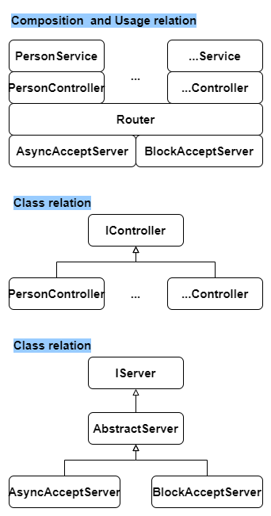

## About this project

The web api project are written using the `boost` framework. There are two kinds of web api server sample code provided, which are respectively using `block accept` with detached threads and `async accept` with async call. For demonstration, person service and ... have been implemented as sample service. Also, auto tests via python and e2e have been provided in `tests` folder.

## Version

There is a Version Zero on my github. The Version Zero remains the original code structure. And the Version One would have more enhancement on the code structure, coding style (more functional programming style), and i will going to add more features on this repo. 

## Source code structure

### Tree view
```console
├── CMakeLists.txt
├── include
│   ├── context.hpp
│   ├── controllers
│   │   ├── abstract_controller.hpp
│   │   ├── interface_controller.hpp
│   │   ├── ...
│   │   └── person_controller.hpp
│   ├── models
│   │   ├── ...
│   │   └── person.hpp
│   ├── router.hpp
│   ├── serializers
│   │   ├── nlohmann
│   │   │   ├── json_fwd.hpp
│   │   │   └── json.hpp
│   │   ├── ...
│   │   └── person_serializer.hpp
│   ├── server
│   │   ├── abstract_server.hpp
│   │   ├── async_accept_server.hpp
│   │   ├── block_accept_server.hpp
│   │   └── interface_server.hpp
│   └── services
│       └── person_service.hpp
├── README.md
├── src
│   ├── context.cpp
│   ├── controllers
│   │   ├── abstract_controller.cpp
│   │   ├── ...
│   │   └── person_controller.cpp
│   ├── main.cpp
│   ├── models
│   │   ├── ...
│   │   └── person.cpp
│   ├── router.cpp
│   ├── serializers
│   │   ├── ...
│   │   └── person_serializer.cpp
│   ├── server
│   │   ├── abstract_server.cpp
│   │   ├── async_accept_server.cpp
│   │   └── block_accept_server.cpp
│   └── services
│       ├── ...
│       └── person_service.cpp
└── tests
    ├── README.md
    ├── requirements.txt
    └── test_api_person.py
```

### Composition Relationship


## Pre-installation
reference about install boost library (if your kernel unable install boost library easily)
https://askubuntu.com/questions/806478/xenial-16-04-cannot-find-package-libboost-all-dev
```console
# update apt
sudo add-apt-repository universe
sudo apt-get update

# boost library
sudo apt-get install libboost-all-dev

# check boost library
sudo apt search libboost
# or
dpkg -s libboost-dev | grep 'Version'
```

## How to buid and run

### Build with cmake
```console
# to build folder
mkdir build && cd build

# build
rm -rf * && cmake .. && make

# build async accpet server
rm -rf * && cmake -DUSE_ASYNC_ACCEPT=ON .. && make

# build block accept server
rm -rf * && cmake -DUSE_BLOCK_ACCEPT=ON .. && make

```

### Build with meson
```
# select meson.options
#option('USE_ASYNC_ACCEPT', type: 'boolean', value: false, description: 'Use async accept server')
#option('USE_BLOCK_ACCEPT', type: 'boolean', value: true, description: 'Use block accept server')

# meson build
rm -rf build && meson build

# to build folder 
cd build

# ninja build
ninja
```

### Run program
```console
./WebApi
```

## Tests

### Test via pytest
We have provide e2e tests via python scripts \
(please refer to the follwing README.md and navigate to tests folder) \
[tests/README.md](tests/README.md)

### Test via curl:
```console
# curl --help
# -X/--request [GET|POST|PUT|DELETE|PATCH]
# -H/--header
# -i/--include
# -d/--data 
# -v/--verbose
# -u/--user
# -b/--cookie

# POST
curl -X POST -H "Content-Type: application/json" -d '{"name": "John Doe", "age": 30}' http://localhost:1999/api/person -v

# GET
curl -X GET -H "Content-Type: application/json" http://localhost:1999/api/person -v

# PUT (not yet)
#curl -X PUT -H "Content-Type: application/json" -d '{"name": "John Doe", "age": 30}' http://localhost:1999/api/person -v

# GET
curl -X GET -H "Content-Type: application/json" http://localhost:1999/api/person/0 -v

# DELETE
curl -X DELETE -H "Content-Type: application/json" http://localhost:1999/api/person/0 -v
```

## Another simple web api version via C++ and boost library (if the code in this project is too complex)
client command
```console
curl -X GET http://localhost:8080/api/message -v

```
CMakeLists.txt
```cmake
cmake_minimum_required(VERSION 3.10)
project(RestfulApi)

set(CMAKE_CXX_STANDARD 17)

find_package(Boost REQUIRED COMPONENTS system filesystem)
include_directories(${Boost_INCLUDE_DIRS})

add_executable(RestfulApi main.cpp)
target_link_libraries(RestfulApi ${Boost_LIBRARIES})

find_package(Threads REQUIRED)
target_link_libraries(RestfulApi Threads::Threads)
```
main.c
```C++
#include <boost/beast/core.hpp>
#include <boost/beast/http.hpp>
#include <boost/beast/version.hpp>
#include <boost/asio/ip/tcp.hpp>
#include <boost/asio/strand.hpp>
#include <boost/config.hpp>
#include <nlohmann/json.hpp>
#include <iostream>
#include <memory>
#include <string>
#include <thread>

namespace beast = boost::beast; // from <boost/beast.hpp>
namespace http = beast::http;   // from <boost/beast/http.hpp>
namespace net = boost::asio;    // from <boost/asio.hpp>
using tcp = net::ip::tcp;       // from <boost/asio/ip/tcp.hpp>

//
// Handle request functions
//

// Prepare response
void prepareResponse(http::request<http::string_body> const& req, http::response<http::string_body>& res, const nlohmann::json& json_response) {
    res.set(http::field::server, "Beast");
    res.set(http::field::content_type, "application/json");
    res.keep_alive(req.keep_alive());
    res.body() = json_response.dump();
    res.prepare_payload();
}

// This function produces an HTTP response for the given request.
http::response<http::string_body> handle_request(http::request<http::string_body> const& req) {
    // Default response for unsupported url
    if (req.target() != "/api/message") {
        http::response<http::string_body> res{http::status::bad_request, req.version()};
        nlohmann::json json_response = {{"error", "This URL is not supported"}};
        prepareResponse(req, res, json_response);
        return res;
    }

      // Handle GET request
    if (req.method() == http::verb::get) {
        nlohmann::json json_response = {{"message", "This is a GET request"}};
        http::response<http::string_body> res{http::status::ok, req.version()};
        prepareResponse(req, res, json_response);
        return res;

    } // Handle POST request
    else if (req.method() == http::verb::post) {
        auto json_request = nlohmann::json::parse(req.body());
        std::string response_message = "Received: " + json_request.dump();
        nlohmann::json json_response = {{"message", response_message}};
        http::response<http::string_body> res{http::status::ok, req.version()};
        prepareResponse(req, res, json_response);
        return res;

    } // Handle PUT request
    else if (req.method() == http::verb::put) {
        auto json_request = nlohmann::json::parse(req.body());
        std::string response_message = "Updated: " + json_request.dump();
        nlohmann::json json_response = {{"message", response_message}};
        http::response<http::string_body> res{http::status::ok, req.version()};
        prepareResponse(req, res, json_response);
        return res;

    } // Handle DELETE request
    else if (req.method() == http::verb::delete_) {
        nlohmann::json json_response = {{"message", "Resource deleted"}};
        http::response<http::string_body> res{http::status::ok, req.version()};
        prepareResponse(req, res, json_response);
        return res;

    } // Default response for unsupported methods
    else {
        http::response<http::string_body> res{http::status::bad_request, req.version()};
        nlohmann::json json_response = {{"error", "This method is not supported"}};
        prepareResponse(req, res, json_response);
        return res;
    }
}

//
// Session
//

// Create seesion to handle HTTP request.
class Session : public std::enable_shared_from_this<Session> {
    tcp::socket socketID;
    beast::flat_buffer buffer;
    http::request<http::string_body> req;

public:
    explicit Session(tcp::socket socket)
        : socketID(std::move(socket)) {}

    void run() {
        do_read();
    }

private:
    void do_read() {
        auto self(shared_from_this());
        http::async_read(self->socketID, self->buffer, self->req,
            [self](beast::error_code ec, std::size_t) {
                if (! ec) {
                    self->do_write( handle_request(self->req) );
                }
            });
    }

    void do_write(http::response<http::string_body> res) {
        auto self(shared_from_this());
        auto sp = std::make_shared<http::response<http::string_body>>(std::move(res));
        http::async_write(socketID, *sp,
            [self, sp](beast::error_code ec, std::size_t) {
                self->socketID.shutdown(tcp::socket::shutdown_send, ec);
            });
    }
};

//
// Listner
//

// Listner (or server) that accepts incoming connections and launches sessions.
class Listener : public std::enable_shared_from_this<Listener> {
    net::io_context& ioc;
    tcp::acceptor acpt;

public:
    Listener(net::io_context& ioc, tcp::endpoint endpoint)
        : ioc(ioc), acpt(net::make_strand(ioc)) {
        beast::error_code ec;

        // Open the acceptor
        acpt.open(endpoint.protocol(), ec);
        if (ec) {
            std::cerr << "Open error: " << ec.message() << std::endl;
            return;
        }

        // Allow address reuse
        acpt.set_option(net::socket_base::reuse_address(true), ec);
        if (ec) {
            std::cerr << "Set option error: " << ec.message() << std::endl;
            return;
        }

        // Bind to the server address
        acpt.bind(endpoint, ec);
        if (ec) {
            std::cerr << "Bind error: " << ec.message() << std::endl;
            return;
        }

        // Start listening for connections
        acpt.listen(net::socket_base::max_listen_connections, ec);
        if (ec) {
            std::cerr << "Listen error: " << ec.message() << std::endl;
            return;
        }
    }

    ~Listener() {
        // !!! rememeber to release acceptor
        //     so that next time the function can work normally
        acpt.close();
    }

public:
    //
    // using acceptor
    //
    // using net::make_strand :
    //      to ensure that Boost.Asio operations and handlers are used in a thread-safe manner
    //
    void do_accept() {
        acpt.async_accept(net::make_strand(ioc),
            [this](beast::error_code ec, tcp::socket socket) {
                if (!ec) {
                    std::make_shared<Session>(std::move(socket))->run();
                }
                do_accept();
            });
    }
};

//
// Main
//

int main() {
    try {
        auto const address = net::ip::make_address("0.0.0.0");
        unsigned short port = 8080;

        net::io_context ioc{1};

        auto listener = std::make_shared<Listener>(ioc, tcp::endpoint{address, port});
        listener->do_accept();

        // run event loop and suspend here
        ioc.run();
        /*
        The ioc.run() in Boost.Asio is a crucial part of the library’s asynchronous I/O operations.
        Here’s what it does:
            Event Loop:
                io_context.run() starts an event loop that processes all the asynchronous operations (handlers) that have been scheduled on the io_context. This loop continues running until there are no more handlers to execute or the io_context is stopped.
            Blocking Call:
                The run() function blocks the calling thread until all work has finished. This means it will keep the thread busy processing I/O events until there are no more events to handle or the io_context is explicitly stopped1.
            Thread Pool:
                Multiple threads can call io_context.run() to create a pool of threads that can concurrently process handlers. This is useful for improving performance in multi-threaded applications
        Note that: If you are not using any asynchronous operations in Boost.Asio, you don’t need to call ioc.run().
        */

    } catch (const std::exception& e) {
        std::cerr << "Error: " << e.what() << std::endl;
    }
}
```

## Other references
references about http and boost library \
https://medium.com/@AlexanderObregon/building-restful-apis-with-c-4c8ac63fe8a7
